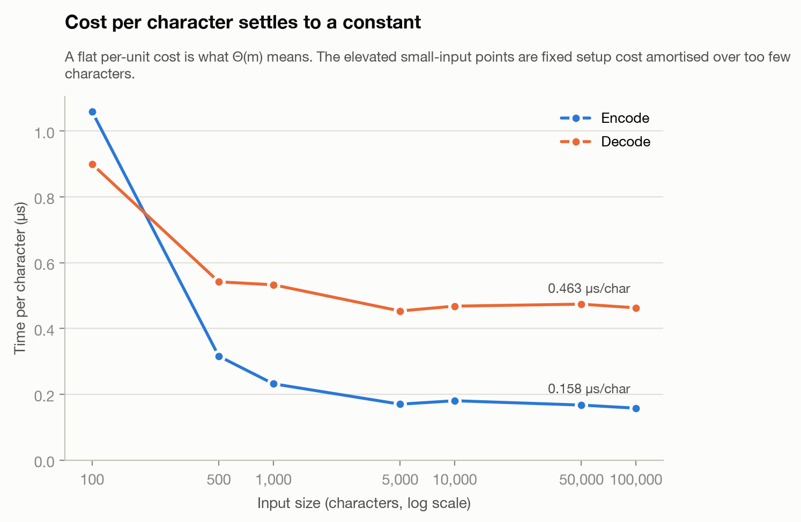
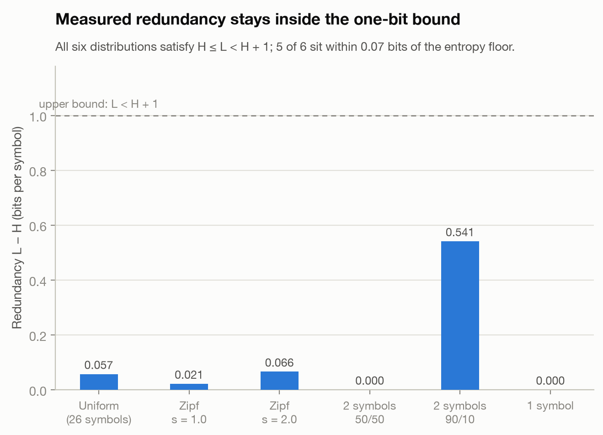
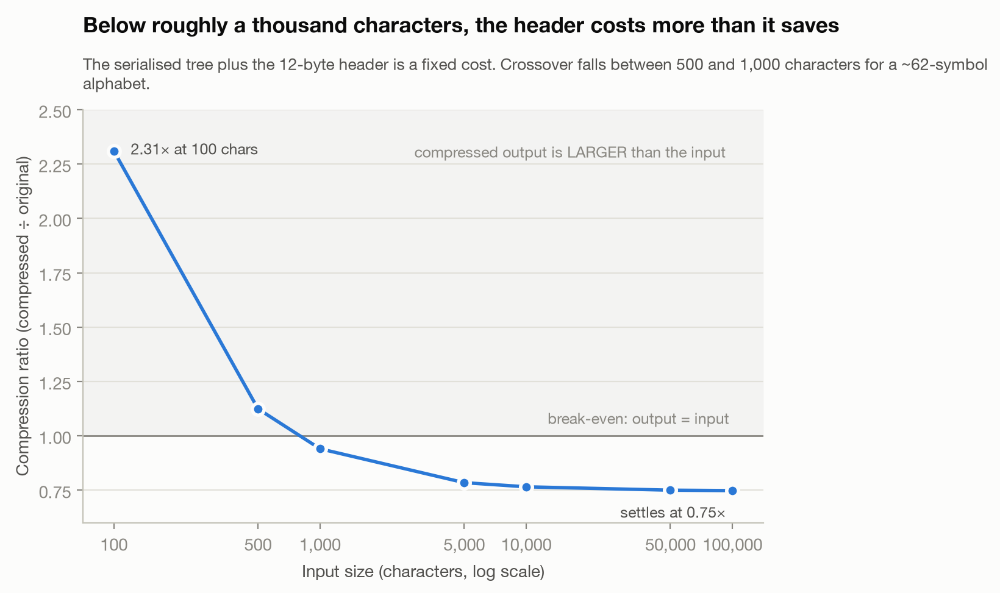
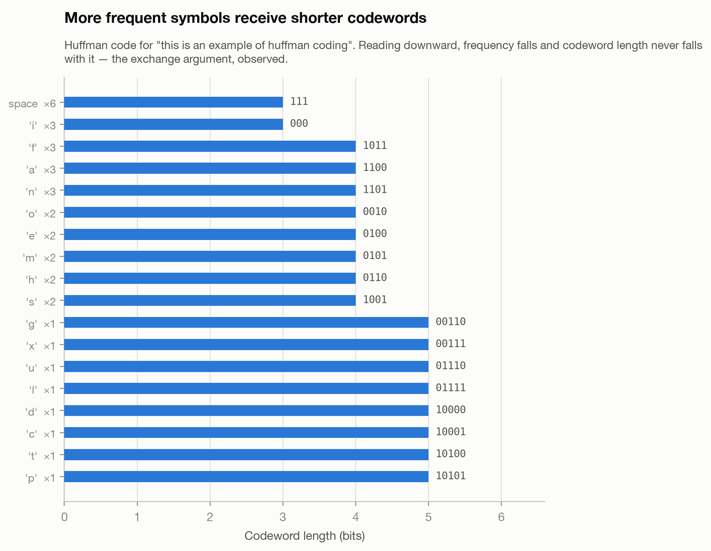

# Research Paper

- Name: Ryu Hemingway
- Semester: SU2026
- Topic: Huffman Coding Algorithm
- Language: Python

## Introduction:

In 1951 a student named David Huffman took an information theory course for his electrical engineering graduate program. The class was offered to either write a report or take an exam and naturally, Huffman decided the report would be easier than the exam. For the report, Huffman was assigned the problem of encoding a set of symbols in binary using as few digits as possible.[4]. Coming close to giving up, he finally recognised that assigning the longest codes first and proceeding from the branches toward the root yields an optimal solution every time [6]. His report ended up being published and is still used to this day for lossless data compression.

Huffman coding is a type of prefix code (a set of code words where no code word is the start of another code word) that is predominantly used for lossless data compression. Lossless data compression is the process of compressing a file and then reversing the compression process without losing any information. The method used to achieve lossless compression is based on the observation that fixed-width encoding wastes space. Giving the letters 'A' and 'X' both 8 bits is wasteful if 'A' occurs 10 times more frequently than 'X'. Therefore, the basis of the algorithm is, if some symbols appear more often than others, assign the more frequent symbols shorter codes. ASCII, for example, allocates eight bits per character regardless of its frequency. This creates a memory inefficiency, since fixed-width encoding expends identical storage on symbols of potentially significantly different utility. Huffman encoding solves this by eliminating the redundancy through assigning shorter code words to higher-frequency symbols. The justification behind this principle will be explored in more depth throughout the report.

$$
\begin{aligned}
\text{Compression:}&\quad \text{File}_{100\text{MB}} \xrightarrow{\text{encode}} \text{File}_{70\text{MB}} \\[6pt]
\text{Decompression:}&\quad \text{File}_{70\text{MB}} \xrightarrow{\text{decode}} \text{File}_{100\text{MB}}
\end{aligned}
$$

## Analysis of Algorithm/Datastructure:

### Time Complexity:

When analysing the time and space complexity of Huffman's algorithm, two parameters dictate the result. Let n denote the number of distinct symbols in the source alphabet, and m the total number of symbols in the input. For byte oriented input, n cannot exceed 256, since a byte represents atmost 256 distinct values, whereas m grows without bound as the file grows. For any input of non trivial length it follows that n ≪ m, and the two parameters must therefore be kept distinct since they appear in different terms of the cost.

The algorithm runs in four steps:

1. Count how many times each distinct symbol occurs in the input file.
2. Build the code tree from those counts: make each symbol a leaf weighted by its count, then repeatedly merge the two lowest-weight nodes under a new parent whose weight is their sum, until one node remains.
3. Read each symbol's codeword off the tree by walking from the root to its leaf, appending 0 for a left step and 1 for a right step.
4. Encode the file in a second pass, replacing each symbol with its codeword.

**Pseudo-code**

```
FUNCTION HUFFMAN(text):
    // Phase 1: count frequencies
    freq ← empty dictionary
    for each character c in text:
        freq[c] ← freq[c] + 1

    // Phase 2: build the Huffman tree
    heap ← empty min-heap
    for each (c, f) in freq:
        node ← new leaf(f, c)
        heap.insert(node)

    while heap.size > 1:
        left  ← heap.extractMin()
        right ← heap.extractMin()
        parent ← new internal node(left.freq + right.freq, left, right)
        heap.insert(parent)

    root ← heap.extractMin()

    // Phase 3: build the code table (prefix-code map)
    codes ← empty dictionary
    walk(node, prefix):
        if node.isLeaf:
            codes[node.char] ← prefix
        else:
            walk(node.left,  prefix + "0")
            walk(node.right, prefix + "1")
    walk(root, "")

    // Phase 4: encode
    encoded ← ""
    for each character c in text:
        encoded ← encoded + codes[c]

    return (encoded, root)


FUNCTION DECODE(encoded, root):
    decoded ← ""
    node ← root
    for each bit b in encoded:
        if b = "0":  node ← node.left
        else:        node ← node.right
        if node.isLeaf:
            decoded ← decoded + node.char
            node ← root    // restart from root for next codeword
    return decoded
```

Counting and encoding only take 1 passover of the data so each one costs Θ(m). Building the tree costs O(n log n), giving a total of Θ(m + n log n).

The cost of the tree comes from merging the loop. Each merge needs the two smallest remaining weights, then the heap finds the smallest in O(log n) time. For building a tree of n leaves and n-1 internal nodes, it will take 2n-1 insert and 2n-1 extractMin operations which with a binary heap gives O(n log n)[3]. An important point to note is that the log factor comes from sorting, not merging. Van Leeuwen proved this by showing the tree can be built in linear time if the weights are already sorted since internal nodes are are ceated and consumed in non-decreasing weight order[3,5]. His technique is called the Two-Queue Method.

### Space Complexity:

In terms of space complexity, every merge removes two nodes from the queue and returns one, so the number of live nodes falls by exactly one per merge. Reducing n leaves to a single root therefore requires n−1 merges. Since each merge creates one internal node, the finished tree contains n leaves and n−1 internal nodes, resulting in 2n−1 in total. Each node stores a weight with two child pointers and constant number of words, so the tree occupies Θ(n) space. The same mechanism bounds the heap. It begins with n entries and never grows beyond that. The frequency table holds one counter per distinct symbol, also n. Every structure is therefore linear in the alphabet size, and total working space is Θ(n). Because m does not appear in this bound, memory consumption is governed by alphabet size rather than input length, and neither pass requires the input to be resident in full.

## General analysis of the algorithm/datastructure:

The Hoffman Algorithm minimises total encoded length. This is best represented by the function: Σ f(s) · L(s). Where f(s) is the frequency of symbol s and L(s) the length in bits of its codeword. Huffman states the objective in normalised form, as the average message length Lav = Σ P(i)L(i) over message probabilities P(i), and defines a minimum-redundancy code as one yielding the lowest possible average message length for an ensemble of N members and D coding digits [2]. The two formulations differ only by the constant factor m, so minimising either minimises the other. The algorithm is also greedy: at each step it merges the two lowest-weight nodes available, never reconsidering an earlier choice [3, 4]. Greedy strategies ordinarily yield only approximations. Huffman himself notes that the Shannon and Fano procedures are not optimum, approaching optimal behaviour only as N tends to infinity [2].

Huffman's greedy choice is the unusual case in which the strategy is provably optimal, and proving it relies on two properties. The first is the greedy-choice property: some optimal code places the two lowest-weight symbols as sibling leaves at maximum depth. Huffman establishes this by an exchange argument. For an optimum code, the length of a given message code can never be less than that of a more probable message code, since interchanging the two so that the shorter is associated with the more probable message would reduce average message length [2]. Because the interchange merely permutes an existing assignment rather than altering the set of codewords, the prefix property is preserved. Also because the improvement is strict, "more frequent implies shorter" is a necessary condition for optimality rather than a design heuristic. Huffman derives two further necessary conditions: that L(N) must equal L(N−1), and that at least two and no more than D of the codes of length L(N) must be identical except in their final digits [2]. The second is optimal substructure: replacing the merged pair with a composite symbol of summed weight produces an instance one symbol smaller, whose optimal solution extends to an optimal solution of the original. Huffman expresses this as a sequence of auxiliary ensembles, each containing one fewer message than its predecessor, applied until two members remain [2]. He then argues that the conditions established as necessary are also sufficient, so the procedure always establishes an optimum binary code [2].

## Empirical Analysis

Two experiments were run to test whether the behaviour predicted in the analysis above actually appears when the algorithm is run. The first experiment focused on varying the total number of symbols m while holding the alphabet approximately constant. This was done in order to isolate the Θ(m) term. For the second experiment, m is fixed at 10,000 characters and only the shape of the symbol distribution varies, in order to test the relationship between compression and entropy. Both are driven by `empirical_analysis.py` with the random seed fixed at 42, so the results reproduce exactly on re-running; the raw measurements are committed as `output/time_vs_size.csv` and `output/compression_ratio.csv`. 

### Time Vs. Input size:

Inputs ranging from 100 to 100,000 random alphanumeric characters were compressed and then decompressed, and on every trial the decompressed result was checked against the original to confirm that nothing had been lost. The total time taken does rise roughly in proportion to the input size, but a clearer test is to measure the cost per character, since a per-character cost that stays flat is exactly what Θ(m) predicts.



As seen in Figure 1, both curves drop steeply at first and then flatten out. Encoding settles at 0.158 µs per character and decoding at 0.463 µs per character. Over the last tenfold increase in input size, from 10,000 to 100,000 characters, encoding time grows by a factor of 8.8 and decoding by a factor of 9.9, where Θ(m) predicts a factor of 10. The higher cost at the small input sizes does not mean the algorithm stops being linear. It is the fixed cost of building the tree, which at 100 characters is being spread over too few symbols for it to disappear into the average.

An important point to note is that decoding is consistently around three times slower than encoding. This is a property of the implementation rather than of the algorithm itself. Encoding only performs one dictionary lookup per character, whereas decoding has to walk the tree one step for every bit, and since the average codeword is roughly six bits long this works out at six times as many steps for each character that is recovered.

### Compression Ratio and Symbol Distribution:

The second experiment fixes the input at 10,000 characters and changes only the distribution of the symbols. As the entropy falls the compression steadily improves. A uniform alphabet of 26 symbols has an entropy of 4.6988 bits and compresses to 60.34% of its original size, a Zipf distribution with s = 1.0 has an entropy of 3.9578 bits and compresses to 50.64%, and with s = 2.0 the entropy is 2.0895 bits and it compresses to 27.83%. Compression therefore tracks the entropy of the source rather than the size of the file, which is what the theory requires. The guarantee given by the theory is that the average codeword length L will satisfy H ≤ L < H + 1. Measuring the redundancy, which is the difference L − H, therefore tests that bound directly.



Every one of the distributions satisfies the bound, and five of the six come within 0.07 bits of the entropy floor, which confirms that Huffman coding is close to optimal in the ordinary case. The sixth distribution is the exception. The two cases that use only two symbols produce the most interesting result of the whole experiment. A distribution where the two symbols occur equally often has an entropy of 0.9999 bits, and a distribution where one symbol occurs 9x as often as the other has an entropy of 0.4588 bits, which is less than half as much. Despite that difference, both compress to exactly the same size of 1,267 bytes, and both end up with an average codeword length of exactly 1.0 bits per symbol.

The reason for this is that a Huffman codeword has to be a whole number of bits, and no symbol can ever be given fewer than one bit. When the entropy of a source falls below one bit per symbol, the code has no way of following it down any further. In the skewed case the redundancy is 0.5412 bits, so roughly 54% of every bit that gets written is waste that the theory says does not need to be spent at all. This is the practical limit of the algorithm, and it is the exact limitation that arithmetic coding was developed to solve, since arithmetic coding does not have to use a whole number of bits for each symbol [3].

### Fixed Overhead and the Break Even Point:

Since the compressed file has to carry its own decoding tree inside it, compression does not come for free at the smaller input sizes.



As can be seen in Figure 3, at 100 characters, the output is 2.31 times larger than the input. Even at 500 characters, it is still 1.12 times larger. However, when we reach 1,000 characters, the output finally becomes smaller than the input, at a ratio of 0.94. After 1000 characters the ratio begins to settles towards 0.7477. The point at which compression starts to pay off seems to fall somewhere between 500 and 1,000 characters for an alphabet of this size. The sample run recorded in output/sample_run.txt encodes a 36-character string made up of 18 distinct symbols: "this is an example of huffman coding". The preorder tree serialisation writes two bytes for every leaf and one byte for every internal node, which gives 18 × 2 + 17 = 53 bytes and the fixed header adds a another 12 bytes on top of that. This comes to 65 bytes of overhead against only 18 bytes of actual encoded data, or 83 bytes in total which is exactly what the sample run records. The overhead grows with the alphabet size n while the saving grows with the input length m, so the method only begins to pay off once m is large enough to dominate n.

### Frequency and Codeword Length:

Finally, the code table that was produced for the sample string can be checked directly against the exchange argument set out earlier in the report.



Reading down the chart, the frequency of the symbols falls but the length of their codewords never falls with it. This is exactly what the exchange argument requires because more frequent symbols get smaller codewords while less frequent ones get more. The space character appears 6 times and is given a 3 bit code, whereas every symbol that appears only once is given 5 bits. The average codeword length works out at 3.972 bits against an entropy of 3.933 bits, so the redundancy here is only 0.039 bits. This should also be compared against the eight bits per character that a fixed-width encoding would spend on the same string.

## Application

- What is the algorithm/datastructure used for?
- Provide specific examples
- Why is it useful / used in that field area?
- Make sure to provide sources for your information.

## Implementation

Implimentation of 

- What language did you use?
- What libraries did you use?
- What were the challenges you faced?
- Provide key points of the algorithm/datastructure implementation, discuss the code.
- If you found code in another language, and then implemented in your own language that is fine - but make sure to document that.

## Summary

- Provide a summary of your findings
- What did you learn?

## LLM Use Disclosure

## References  

[1] Thomas H. Cormen, Charles E. Leiserson, Ronald L. Rivest, and Clifford Stein. 2009. Introduction to Algorithms (3rd. ed.). MIT Press Cambridge, MA.

[2] David A. Huffman. 1952. A method for the construction of minimum-redundancy codes. Proceedings of the Institute of Radio Engineers 40, 9 (September 1952), 1098-1101. https://doi.org/10.1109/JRPROC.1952.273898

[3] Alistair Moffat. 2019. Huffman coding. ACM Comput. Surv. 52, 4, Article 85 (2019), 35 pages. https://doi.org/10.1145/3342555

[4] Inna Pivkina. [n. d.]. Discovery of Huffman codes. Convergence, Mathematical Association of America. Retrieved August 4, 2026 from https://www.cs.nmsu.edu/historical-projects/Projects/18920140825Huffman.pdf

[5] Jan van Leeuwen. 1976. On the construction of Huffman trees. In Proceedings of the 3rd International Colloquium on Automata, Languages and Programming (ICALP). Edinburgh University Press, Edinburgh, 382-410.

[6] Gary Stix. 1991. Profile: David A. Huffman. Scientific American 265, 3 (September 1991), 54, 58.
